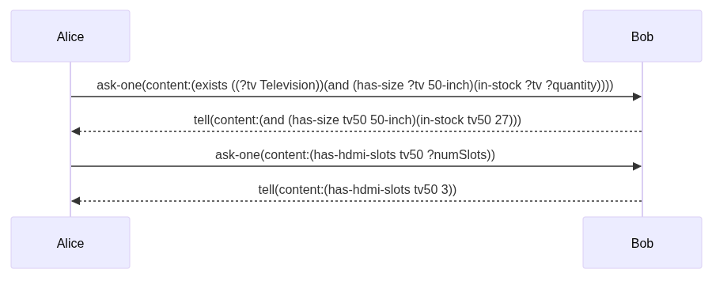

# Creating Agent Dialogues
{: .hidden-title }

## Activity
In this activity, create an agent dialogue, using KQML and KIF, between two agents (named Alice and Bob).

Alice is an agent designed to procure stock and Bob is an agent that controls the stock levels for a warehouse. This dialogue should see Alice asking Bob about the available stock of 50 inch televisions, and also querying the number of HDMI slots the televisions have.

## Learning Outcomes
- An understanding of the motivations for, and appropriate use of, agent-based computing.
- An understanding of the main agent models in use today and their grounding in artificial intelligence research.


### Step 1: Alice queries Bob about stock availability

Alice is asking Bob: "Is there any television of 50-inch size in stock? If yes, how many?"

```kqml
(kqml
  :sender Alice
  :receiver Bob
  :performative ask-one
  :content 
    (KIF 
      (exists ((?tv Television))
        (and 
          (has-size ?tv 50-inch)
          (in-stock ?tv ?quantity)
        )
      )
    )
)
```

### Step 2: Bob responds with stock information
Bob replies: "Yes, we have a 50-inch television (model tv50), and there are 13 units in stock."

```kqml
(kqml
  :sender Bob
  :receiver Alice
  :performative tell
  :content 
    (KIF 
      (and
        (has-size tv50 50-inch)
        (in-stock tv50 13)
      )
    )
)
```

### Step 3: Alice asks about HDMI slots for that television
Alice asks: "How many HDMI slots does tv50 have?"
```kqml
(kqml
  :sender Alice
  :receiver Bob
  :performative ask-one
  :content 
    (KIF 
      (has-hdmi-slots tv50 ?numSlots)
    )
)
```

### Step 4: Bob replies with the number of HDMI slots
Bob replies: "The TV has 2 HDMI slots."

```kqml
(kqml
  :sender Bob
  :receiver Alice
  :performative tell
  :content 
    (KIF 
      (has-hdmi-slots tv50 2)
    )
)
```

### Sequence diagram
The following sequence diagram is a useful tool for vidualising the interaction between Alice and Bob. 



## Reflection
As part of my coursework on intelligent agents, I explored how two software agents can communicate using standardized protocols — KQML (Knowledge Query and Manipulation Language) for message exchange, and KIF (Knowledge Interchange Format) for expressing the meaning behind those messages.

In the scenario I worked on, I created a dialogue between two agents:

Alice, a procurement agent responsible for sourcing items.

Bob, a warehouse agent that manages stock levels.

The goal was for Alice to ask Bob whether there are any 50-inch televisions in stock, and also to find out how many HDMI slots those televisions have.

To structure their conversation, I used ask-one and tell performatives from KQML. These act as standardized message types — similar to saying “Can you tell me X?” or “Here’s the answer to X.” The content of those messages was expressed in KIF, which allows agents to understand and reason about the information in logical terms.

While the messages may look a bit verbose, especially when compared to human communication, this level of detail is necessary. Unlike humans, agents don’t share context or assumptions, they rely entirely on explicit communication. That’s why formal languages like KQML and KIF are so powerful in multi-agent systems: they provide a common contract that defines how information should be structured, interpreted, and responded to.

What stood out to me was how the structure of the dialogue itself, even without any graphical interface, clearly showed the intent and flow of reasoning between the two agents. It felt more like programming a conversation than writing one, and that’s a useful perspective when thinking about agent design in AI systems.

[Back to Intelligent Agents](/intelligent_agents)