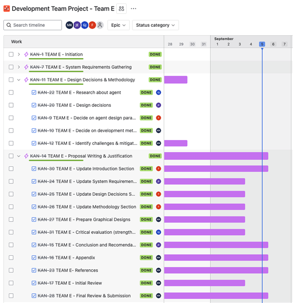
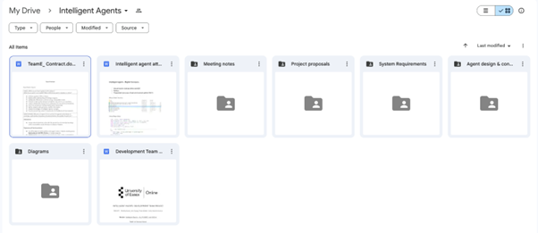
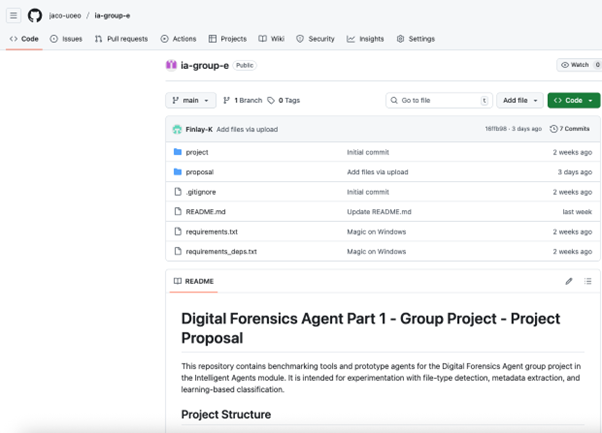

# Team project: Design an Agent-based System
{: .hidden-title }

## Brief
This assignment sees you positioned as a team of software consultants and specialists in agent design and development. You are required to develop an agent that is capable of performing tasks for an organisation with domain-specific requirements.

A domain refers to a group of users with similar application and hardware requirements. A domain may be characterised by having a need to find certain files or content, the need to carry out some processing and a requirement to do something with the processed data. The requirements mean that one or more agents will need to work together to carry out these operations.

The tasks that you should consider are:

- Digital Forensics: Finding specific filetypes on a file system, archiving them and sending the results somewhere for analysis.
- Academic Research Online: Finding results on a website based on search terms (e.g., social media or a search engine), extracting the data and sending to an offline location.

The agreed success criteria for successful development are:

-The agent can identify and retrieve data.

-The data is processed in some way.

-The processed information is stored/saved/presented.

Your team is expected to prepare and deliver a comprehensive design proposal report, describing how you will meet the requirements, design and implementation of the solution for the organisation.

## Meeting Minutes

Throughout the project, the team held several meetings. Below are the minutes from those meetings.

- [Meeting 1](Meeting1.pdf)
- [Meeting 2](Meeting2.pdf)
- [Meeting 3](Meeting3.pdf)
- [Meeting 4](Meeting4.pdf)
- [Meeting 5](Meeting5.pdf)

## Project Management

Project tasks were effectively tracked and managed with the support of a Jira board.

## Document Storage

The team contract and all collaborative documents were maintained on a shared Google Drive for easy access and version control.

## Code Playground

 A [GitHub project](https://github.com/jaco-uoeo/ia-group-e) was established with a template repository to facilitate testing of libraries and design concepts before settling on a final proposal.

