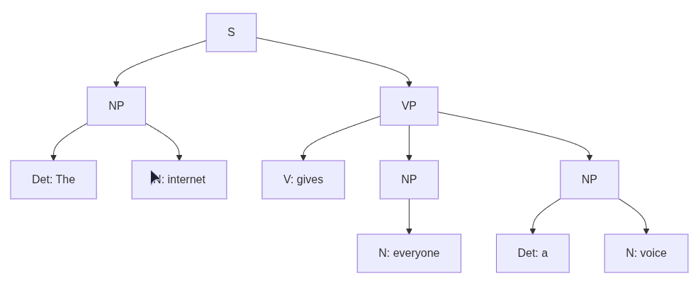
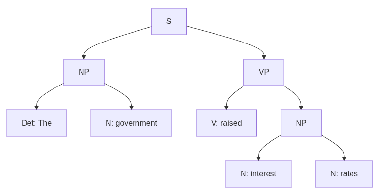
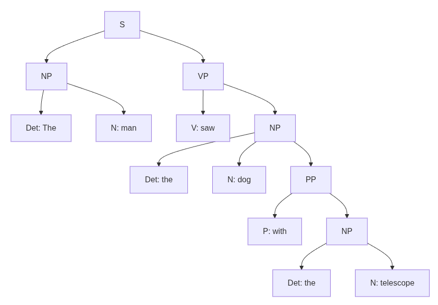

# Creating Parse Trees
{: .hidden-title }

## Activity
In this activity, create a constituency-based parse tree for the following phrases:

- The government raised interest rates.
- The internet gives everyone a voice.
- The man saw the dog with the telescope.

## Learning Outcomes
- The knowledge and skills required to develop, deploy and evaluate the tools and techniques of intelligent systems to solve real-world problems.
- An understanding of contemporary research issues in the area of intelligent agent systems.

## Parse trees

The following is a summary of the labels used th the parse trees.

|Label | Meaning                     |
|------|-----------------------------|
S |	Sentence
NP | Noun Phrase
VP | Verb Phrase
PP | Prepositional Phrase
Det | Determiner
N |	Noun
V |	Verb
P |	Preposition

#### The government raised interest rates

#### The internet gives everyone a voice.

#### The man saw the dog with the telescope.

### Reflection

This week, I explored constituency-based parse trees as part of my Natural Language Processing (NLP) module. Using a series of example sentences, I manually constructed syntax trees to visualise the grammatical structure of English phrases. This activity reinforced my understanding of how language is hierarchically organised, and how sentence structure can be broken down into nested phrases such as noun phrases (NP), verb phrases (VP), and prepositional phrases (PP).

Alongside the activity, I read Zimmerman’s (2019) article Getting to Grips with Parse Trees, which clarified how parse trees reveal the underlying syntactic structure of sentences. The article also discussed dependency-based parsing in spaCy and the use of labelled tokens and edges to navigate sentence structure. While recent advances in deep learning have shifted focus away from traditional parsing, Zimmerman (2019) argues that parse trees remain valuable, particularly in rule-based NLP systems where interpretability and debuggability are key benefits.

This exercise highlighted the continued relevance of linguistic structure in modern NLP and the value of balancing rule-based methods with data-driven approaches.

## References

Zimmerman, V. (2019) “Getting to grips with parse trees,” Towards Data Science, 12 November. Available at: https://towardsdatascience.com/getting-to-grips-with-parse-trees-6e19e7cd3c3c/ (Accessed: 22 September, 2025).

[Back to Intelligent Agents](/intelligent_agents)

