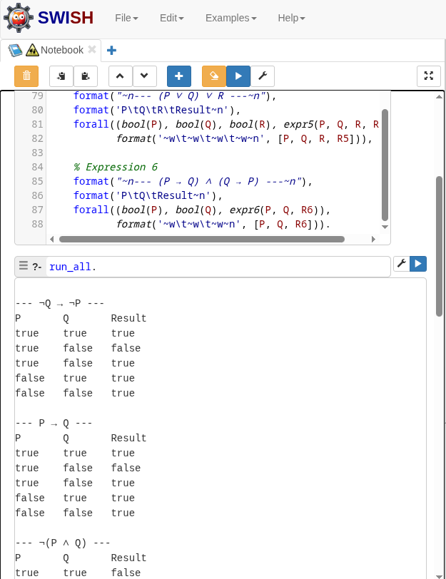
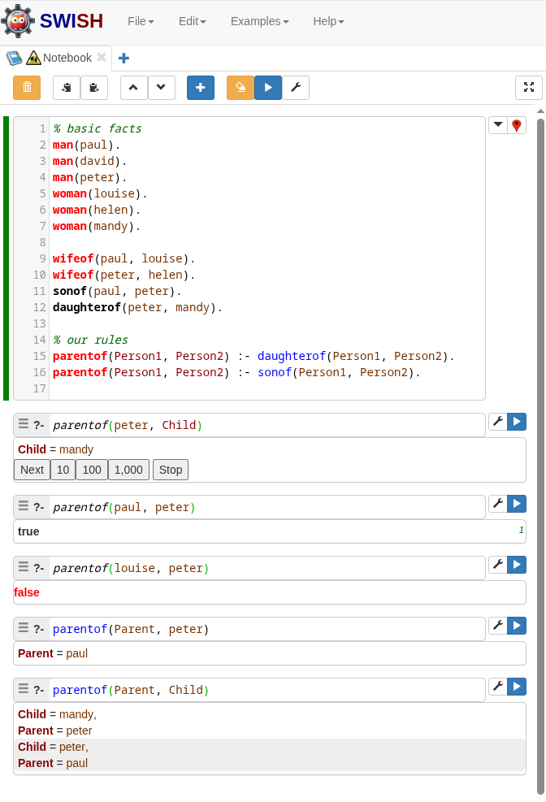
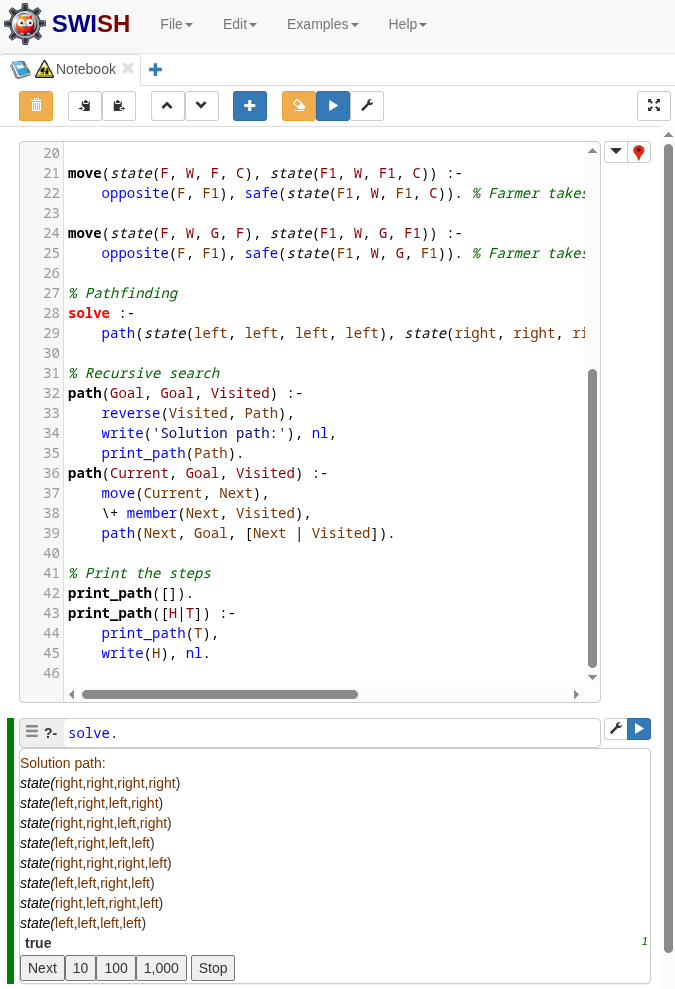

# Introduction to Logic Programming
{: .hidden-title }

## Introduction

In this activity, I used SWI-Prolog to dive back into logic programming by building truth tables for a range of logical expressions. I defined basic Boolean values and operators like AND, OR, NOT, and IMPLIES, and used them to test how different combinations of inputs affect the outcome of a statement. I also had the chance to explore a classic logic puzzle, the river crossing problem, which showed how Prolog can be used to solve pathfinding challenges by searching through possible states and transitions.

### Activity 1: Generate Truth Tables
In this activity we used an [online swi-prolog sandbox](https://swi-prolog.org) to write and evaluate some prolog code for a few basic logic statements. The following program will print out the truth tables for the following statements:

```prolog
% Define Boolean values
bool(true).
bool(false).

% Logical NOT
my_not(true, false).
my_not(false, true).

% Logical AND
my_and(true, true, true).
my_and(_, _, false).

% Logical OR
my_or(false, false, false).
my_or(_, _, true).

% Logical IMPLIES
my_implies(true, false, false).
my_implies(_, _, true).

% Expression 1: ¬Q → ¬P
expr1(P, Q, Result) :-
    my_not(Q, NQ),
    my_not(P, NP),
    my_implies(NQ, NP, Result).

% Expression 2: P → Q
expr2(P, Q, Result) :-
    my_implies(P, Q, Result).

% Expression 3: ¬(P ∧ Q)
expr3(P, Q, Result) :-
    my_and(P, Q, PQ),
    my_not(PQ, Result).

% Expression 4: P ∨ (Q ∧ R)
expr4(P, Q, R, Result) :-
    my_and(Q, R, QR),
    my_or(P, QR, Result).

% Expression 5: (P ∨ Q) ∨ R
expr5(P, Q, R, Result) :-
    my_or(P, Q, PQ),
    my_or(PQ, R, Result).

% Expression 6: (P → Q) ∧ (Q → P)
expr6(P, Q, Result) :-
    my_implies(P, Q, Imp1),
    my_implies(Q, P, Imp2),
    my_and(Imp1, Imp2, Result).

% Run truth tables for each expression individually
run_all :-
    % Expression 1
    format("~n--- ¬Q → ¬P ---~n"),
    format('P\tQ\tResult~n'),
    forall((bool(P), bool(Q), expr1(P, Q, R1)),
           format('~w\t~w\t~w~n', [P, Q, R1])),

    % Expression 2
    format("~n--- P → Q ---~n"),
    format('P\tQ\tResult~n'),
    forall((bool(P), bool(Q), expr2(P, Q, R2)),
           format('~w\t~w\t~w~n', [P, Q, R2])),

    % Expression 3
    format("~n--- ¬(P ∧ Q) ---~n"),
    format('P\tQ\tResult~n'),
    forall((bool(P), bool(Q), expr3(P, Q, R3)),
           format('~w\t~w\t~w~n', [P, Q, R3])),

    % Expression 4
    format("~n--- P ∨ (Q ∧ R) ---~n"),
    format('P\tQ\tR\tResult~n'),
    forall((bool(P), bool(Q), bool(R), expr4(P, Q, R, R4)),
           format('~w\t~w\t~w\t~w~n', [P, Q, R, R4])),

    % Expression 5
    format("~n--- (P ∨ Q) ∨ R ---~n"),
    format('P\tQ\tR\tResult~n'),
    forall((bool(P), bool(Q), bool(R), expr5(P, Q, R, R5)),
           format('~w\t~w\t~w\t~w~n', [P, Q, R, R5])),

    % Expression 6
    format("~n--- (P → Q) ∧ (Q → P) ---~n"),
    format('P\tQ\tResult~n'),
    forall((bool(P), bool(Q), expr6(P, Q, R6)),
           format('~w\t~w\t~w~n', [P, Q, R6])).
```

When running the program we get the following output: 




### Activity 2: Richie (2002)
In this activity we were asked to access [Ritchie (2002)](https://www.inf.ed.ac.uk/teaching/courses/ar/ARPROLOG/stepbystep.pdf) to complete the next activities, however, the file was no longer available. I found an alternative location: [scribd](https://www.scribd.com/document/363885005/Step-by-Step)

```prolog
% basic facts
man(paul).
man(david).
man(peter).
woman(louise).
woman(helen).
woman(mandy).

wifeof(paul, louise).
wifeof(peter, helen).
sonof(paul, peter).
daughterof(peter, mandy).

% our rules
parentof(Person1, Person2) :- daughterof(Person1, Person2).
parentof(Person1, Person2) :- sonof(Person1, Person2).
```



### Activity 3: Crossing problem
This task involved analyzing a “crossing problem” from the **Palomino et al. (2005)** paper using swi-prolog.

```prolog
% Representation: state(Farmer, Wolf, Goat, Cabbage)
% Each value is either 'left' or 'right'

opposite(left, right).
opposite(right, left).

% Unsafe situations
unsafe(state(F, W, G, _)) :- W = G, F \= G.  % Wolf eats Goat
unsafe(state(F, _, G, C)) :- G = C, F \= G.  % Goat eats Cabbage

% Safe move
safe(S) :- \+ unsafe(S).

% Valid moves (farmer crosses alone or with one item)
move(state(F, W, G, C), state(F1, W, G, C)) :-
    opposite(F, F1), safe(state(F1, W, G, C)). % Farmer alone

move(state(F, F, G, C), state(F1, F1, G, C)) :-
    opposite(F, F1), safe(state(F1, F1, G, C)). % Farmer takes wolf

move(state(F, W, F, C), state(F1, W, F1, C)) :-
    opposite(F, F1), safe(state(F1, W, F1, C)). % Farmer takes goat

move(state(F, W, G, F), state(F1, W, G, F1)) :-
    opposite(F, F1), safe(state(F1, W, G, F1)). % Farmer takes cabbage

% Pathfinding
solve :-
    path(state(left, left, left, left), state(right, right, right, right), [state(left, left, left, left)]).

% Recursive search
path(Goal, Goal, Visited) :-
    reverse(Visited, Path),
    write('Solution path:'), nl,
    print_path(Path).
path(Current, Goal, Visited) :-
    move(Current, Next),
    \+ member(Next, Visited),
    path(Next, Goal, [Next | Visited]).

% Print the steps
print_path([]).
print_path([H|T]) :-
    print_path(T),
    write(H), nl.
```



### References

Palomino, M., Martí-Oliet, N. and Verdejo, A. (2005) ‘Playing with Maude’, Electronic Notes in Theoretical Computer Science, 124(1), pp. 3–23. Available at: https://doi.org/10.1016/j.entcs.2004.07.012.


## Reflection

I first worked with logic and Prolog during my undergraduate degree, so this exercise was a great way to revisit those ideas. It reminded me how Prolog approaches problems differently — using rules and relationships instead of step-by-step instructions. Getting it running in the SWISH environment came with a few hiccups, but that actually helped me remember how Prolog thinks. Overall, it was a good refresher and a nice reminder of how useful logic programming can be, especially in areas like AI.