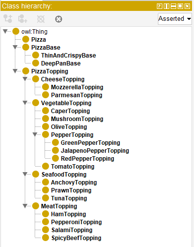
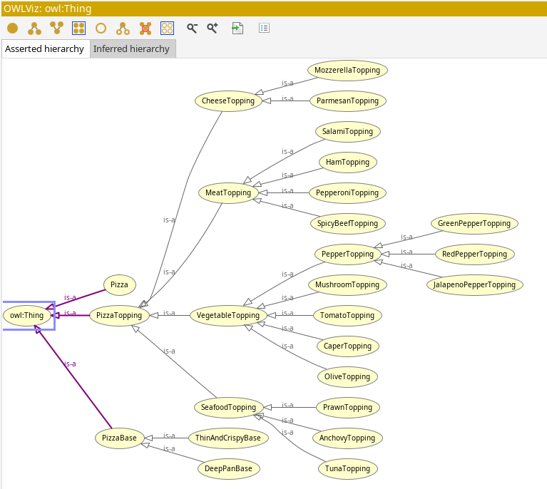

# Guided Tutorial: A Practical Guide to Building OWL Ontologies
{: .hidden-title }

## Introduction

In this activity, I followed the Practical Guide to Building OWL Ontologies Using Protégé (Debellis, 2021) to create a simple ontology using Protégé. The exercise focused on modelling a basic pizza ontology, including core classes such as Pizza, PizzaBase, and PizzaTopping, along with their respective subclasses. Using OWL (Web Ontology Language), I defined class hierarchies and relationships, and explored how tools like OWLViz help visualise the structure of an ontology.

## Reflection

This activity was a helpful hands-on introduction to building ontologies in Protégé. Creating and organising classes gave me a better understanding of how ontologies represent knowledge in a structured and logical way. Using OWL and seeing the class hierarchy come together in OWLViz made the abstract concepts feel more concrete. One thing I noticed was that even in this small example, the class hierarchy became deep quite quickly. It made me wonder how well this kind of structure would scale in larger or more complex ontologies, especially in terms of reasoning performance or maintainability. Still, the exercise privided good foundational knowledge of the tool and how to construct simple ontologies.

## References

Debellis, M. (2021) A Practical Guide to Building OWL Ontologies Using Protégé 5.5 and Plugins, ResearchGate. Available at: https://www.researchgate.net/publication/351037551_A_Practical_Guide_to_Building_OWL_Ontologies_Using_Protege_55_and_Plugins (Accessed: 4 July 2025).

[Back to Knowledge Representation and Reasoning](/krr)