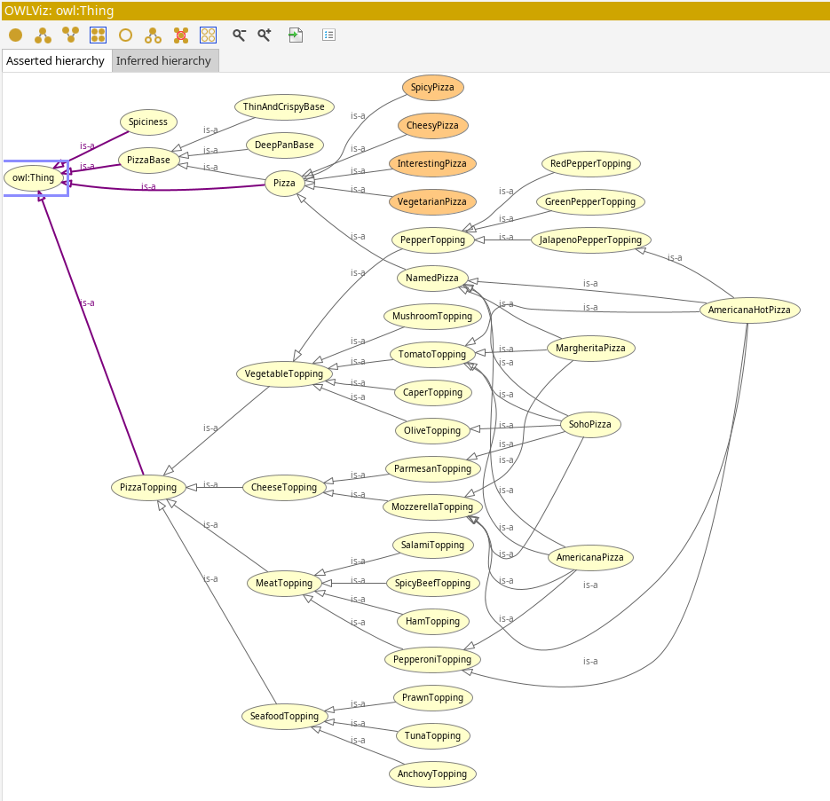

# Guided Tutorial: A Practical Guide to Building OWL Ontologies: Take 2
{: .hidden-title }

## Introduction
In this activity, I extended the pizza ontology [I previously built](../unit08/ontology_development.md) in Protégé by exploring more advanced OWL concepts such as universal restrictions, automated classification with open world reasoning, and enumerated classes. This allowed me to deepen the model by adding constraints that specify not just the existence of some relationships but also restrictions on all relationships. I also learned about how the OWL reasoner classifies classes under the Open World Assumption and how that affects inferred hierarchies. Finally, I worked with enumerated classes to define sets of individuals explicitly.

## Reflection
Building on the initial pizza ontology, this activity helped me appreciate the more subtle and powerful features of OWL. The distinction between existential and universal restrictions clarified how we can control the scope of properties in an ontology. Observing the reasoner’s behavior under the Open World Assumption was eye-opening — it reminded me that OWL handles incomplete knowledge differently from traditional programming, which can be counterintuitive at first. The use of enumerated classes added another useful tool to explicitly list members of a class, enhancing precision. Overall, extending the ontology like this gave me a much better understanding of how OWL’s expressiveness supports detailed and flexible modelling, though I can see how the complexity can increase quickly as the model grows.