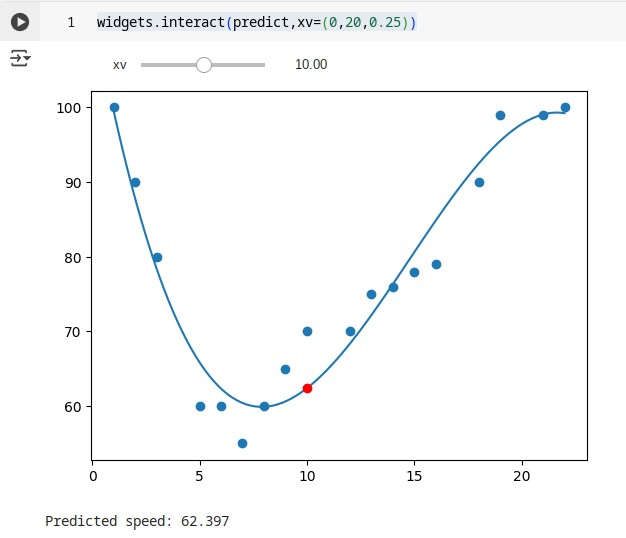

# Regression and Covariance
{: .hidden-title }
## Overview

Regression and covariance are both statistical tools used to explore relationships between variables, helping us make sense of how changes in one thing might relate to changes in another.

### Covariance

Covariance measures the direction of the relationship between two variables. If both variables tend to increase or decrease together, the covariance is positive. If one increases while the other decreases, it’s negative. However, covariance doesn’t indicate the strength of the relationship, nor does it standardize the scale—so while it tells us there is a connection, it doesn’t tell us how meaningful or consistent that connection is.

Pearson’s correlation coefficient, often called "Pearson’s r", is a statistical measure that tells us:
- How strong the relationship is between two variables.
- What direction the relationship goes (positive or negative).

The value of r ranges from –1 to +1:

- +1 means a perfect positive linear relationship (as one variable increases, so does the other).
- –1 means a perfect negative linear relationship (as one increases, the other decreases).
- 0 means no linear relationship.

Pearson’s r is essentially a standardized version of covariance. Covariance depends on the units of the variables. For example, if X is in kilometers and Y is in liters, the covariance will also be in strange combined units (like km·liters), making it hard to interpret or compare across different datasets.

By dividing by the standard deviations, Pearson’s r becomes unitless and always falls within the –1 to +1 range, making it easy to interpret and compare.

### Regression

Regression, particularly linear regression, goes a step further. It not only identifies the relationship between variables but also quantifies it in a way that allows for prediction. For example, in simple linear regression, we might model how distance travelled may affect fule consumption over time. The regression line provides an equation—such as:

```Fuel Used (litres) = 2 + 0.08 × Distance (km)```

This means that your car uses 2 litres of fuel just to get going (idling etc.), and then 0.08 litres for every additional kilometer driven.

So, if you’re planning a 100 km trip, you can estimate:

```Fuel Used = 2 + 0.08 × 100 = 10 litres```

In summary, covariance gives us a basic sense of whether two variables move together, while regression builds a detailed model of that relationship, allowing us to estimate and predict outcomes. Both are foundational in data analysis and are often used together to understand and communicate trends in data.

## Activities

Some of the activities in this unit's module required changinng some parameters on a notebook to see it's affect, to make it easier to visualise these effects, I've made use if ```ipywidgets``` to make these plots interactive. An example can be seen below.

```python
import numpy
from sklearn.metrics import r2_score

import ipywidgets as widgets

x = [1,2,3,5,6,7,8,9,10,12,13,14,15,16,18,19,21,22]
y = [100,90,80,60,60,55,60,65,70,70,75,76,78,79,90,99,99,100]

mymodel = numpy.poly1d(numpy.polyfit(x, y, 3))

def predict(xv):
  speed = mymodel(xv)

  plt.scatter(x, y)
  plt.plot(myline, mymodel(myline))

  #show our predicted speed
  plt.plot(xv, speed, 'ro')
  plt.show()

  print('\nPredicted speed: %.3f\n' % speed)

widgets.interact(predict,xv=(0,20,0.25))

```

The result looks like this:



[](https://colab.research.google.com/github/jaco-uoeo/ml-artefact/blob/main/Unit03/Unit03%20Ex4%20polynomial_regression.ipynb)


Other notebooks reviewed as part of this unit include:

Pearson Correlation 

[](https://colab.research.google.com/github/jaco-uoeo/ml-artefact/blob/main/Unit03/Unit03%20Ex1%20covariance_pearson_correlation.ipynb)

Linear Regression

[](href=\"https://colab.research.google.com/github/jaco-uoeo/ml-artefact/blob/main/Unit03/Unit03%20Ex2%20linear_regression.ipynb)


Multiple Linear Regression

[](href=\"https://colab.research.google.com/github/jaco-uoeo/ml-artefact/blob/main/Unit03/Unit03%20Ex3%20multiple_linear_regression.ipynb)


## Reflection

This part of the module helped me develop a clearer understanding of key statistical concepts like covariance, Pearson’s correlation, and regression. Covariance gave me an initial idea of whether two variables move in the same or opposite direction, but I learned that it doesn’t show the strength or consistency of that relationship. Pearson’s correlation improves on this by standardizing the values, making comparisons across datasets more meaningful.

We also explored regression, which goes further by modeling the relationship and allowing for predictions. Some of the activities involved adjusting parameters in the notebook to observe how different factors influence the model. To make these changes more intuitive and easier to visualize, I incorporated ipywidgets to build interactive plots, which was a helpful way to see how the relationships played out in real time.

[Back to Machine Learning](/machine_learning/)