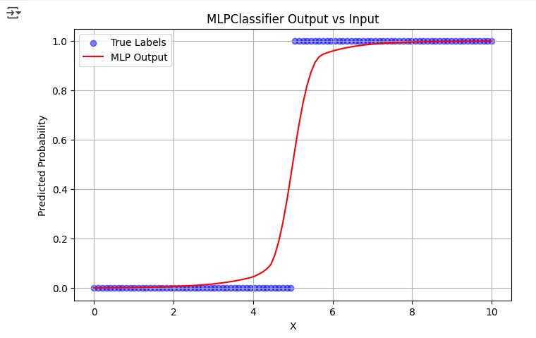

# Perceptrons

A perceptron is a basic type of artificial neural network used for classification tasks. It takes input features, applies weights and a bias, then uses an activation function to produce an output. Essentially, it helps make decisions by classifying data into two categories. While simple and effective for linear problems, the perceptron has limitations, especially when it comes to handling more complex, non-linear data. 

## Activities
The following activities were completed as part of this unit's coursework to better understand perceptrons and how they work in machine learning, providing a foundation for more advanced topics in neural networks.

A perceptron is a simple type of neural network used for classifying data into two categories. It works by taking in several input values, multiplying each by a weight, and adding them together along with a bias. This total is then passed through an activation function, which decides the output—usually 0 or 1. During training, the perceptron adjusts its weights based on how accurate its predictions are. Over time, this helps it learn patterns in the data. While basic, the perceptron is an important starting point for understanding more advanced neural networks and deep learning models.

The completed notebooks can be found on colab.

### Simple Perceptron

A gentrle introduction to how a perceptron is constructed. 

[](https://colab.research.google.com/github/jaco-uoeo/ml-artefact/blob/main/Unit07/Ex1%20simple_perceptron.ipynb)

### AND Operator

A perceptron that learns the weights and bias to correctly model the logical AND function.

To see how this would be build using something like scikit-learn, I have added a self-contained implementation with a similar function in the last cell of the notebook. It outputs 1 only when both inputs are 1, mimicking the behavior of the logical AND. This is an example of using a perceptron for binary classification.

[](https://colab.research.google.com/github/jaco-uoeo/ml-artefact/blob/main/Unit07/Ex2%20perceptron_AND_operator.ipynb)

### Multi-layer Perceptron

Demonstrates a perceptron that can learn a simple rule where it outputs a value close to 1 when the input X is large, and close to 0 when X is small. It does this by adjusting weights and bias during training to create a decision boundary that separates the two input ranges.

The idea was also implemented using skikit-learn's ```MLPClassifier```:




[](https://colab.research.google.com/github/jaco-uoeo/ml-artefact/blob/main/Unit07/Ex3%20multi-layer%20Perceptron.ipynb)

[Back to Machine Learning](/machine_learning/)