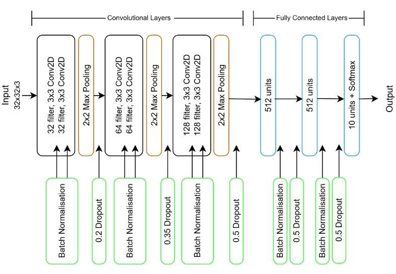

# Individual Presentation
{: .hidden-title }

## Brief

### Assignment Topic: Neural Network Models for Object Recognition

You are tasked with developing a Neural Network using the CIFAR-10 image dataset for object recognition. Available on Kaggle and directly through keras-datasets, CIFAR-10 is a renowned dataset tailored for visual recognition tasks. It is derived from the "80 million tiny images" dataset and comprises 60,000 colored images, each 32x32 pixels, distributed across 10 distinct object categories with 6,000 images for each category. 

Your primary objective is to design the neural networks and assess the model's efficacy. 

### Architecture

For the final CNN architecture, I focused on creating a stable model with good generalization, building on insights from several intermediary tests. I incorporated batch normalization to ensure smoother training and introduced dropout at key points in the network to prevent overfitting. While it’s generally accepted that batch normalization is applied after the ReLU activation, I found that applying ReLU first and then batch normalization actually gave me slightly better performance in my case—which was a bit surprising, but worth noting.

{: .centered}

## Reflection

In my individual presentation, I walked through building a simplified VGG CNN, based on the architecture introduced by Karen Simonyan and Andrew Zisserman from the University of Oxford in 2015. This project really helped solidify my understanding of CNNs and gave me practical insight into how architectural choices affect model performance. The final model achieved an accuracy of 0.9 and a loss of 0.32, with stable training and validation curves and no major signs of overfitting.

I used the Adam optimizer, which performed better than SGD during training—though based on what I’ve read and observed, I’m now curious to explore SGD further, especially for image tasks. Techniques like Batch Normalization, Dropout, and Data Augmentation made a noticeable difference in generalization, and experimenting with these helped me appreciate how small adjustments can impact performance. One challenge I encountered was the increased training time when using higher epoch values and data augmentation, which taught me the importance of balancing experimentation with practicality.

Overall, this project helped me better understand not just how CNNs work, but also how to make informed decisions when designing and tuning a model. It’s given me more confidence to experiment and interpret training results critically.

Bibliography

Simonyan, K. and Zisserman, A. (2015) ‘Very Deep Convolutional Networks for Large-Scale Image Recognition’. arXiv. Available at: https://doi.org/10.48550/arXiv.1409.1556. 

[Back to Machine Learning](/machine_learning/)